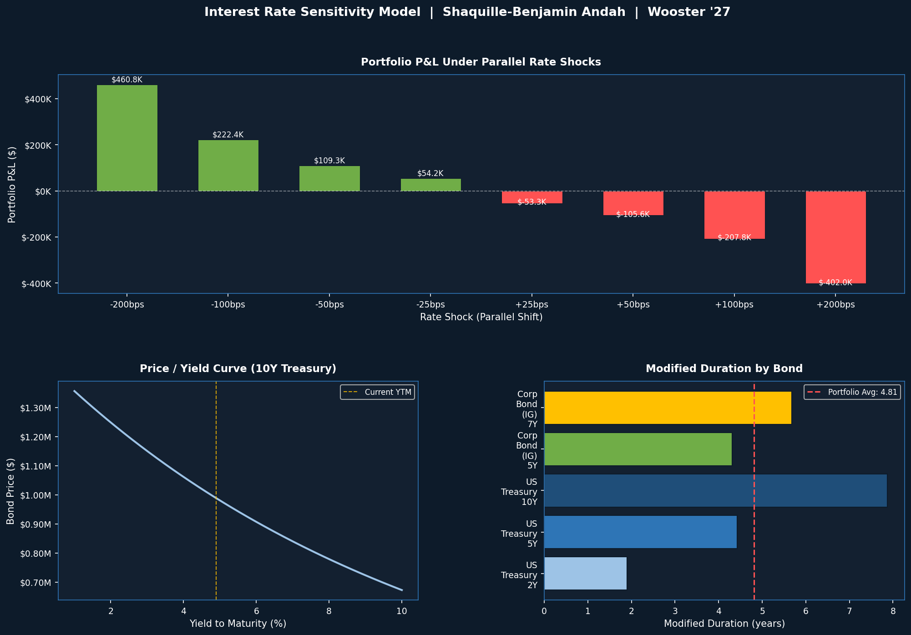
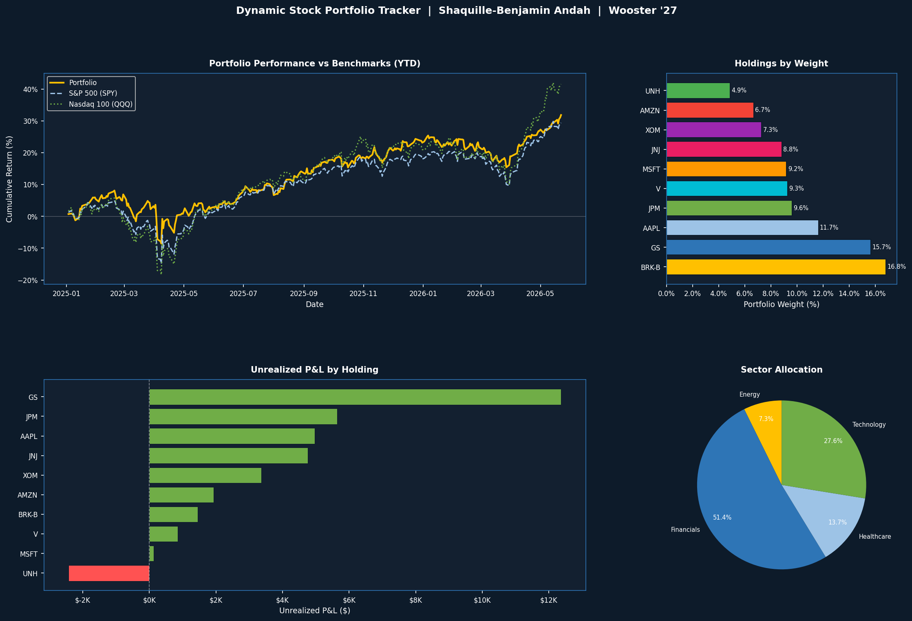
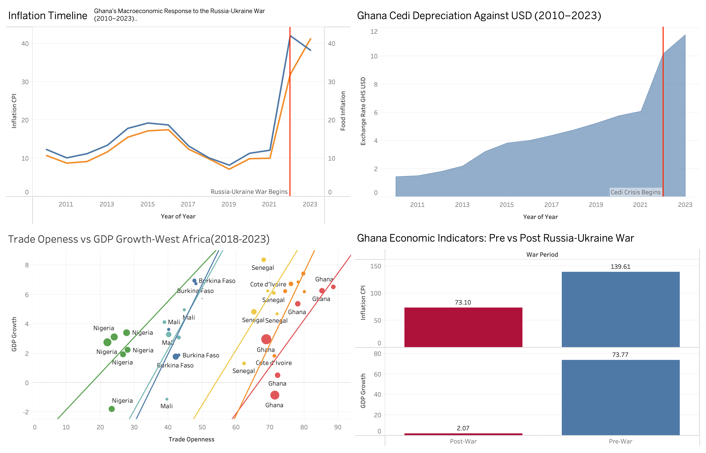

# Investment Research Portfolio
### Shaquille-Benjamin Andah | Business Economics, The College of Wooster '27
#### Market Risk | Financial Analysis | Quantitative Research

---

## Project 1 — Interest Rate Sensitivity Model
**Tools: Python, NumPy, Pandas, Matplotlib**

A Python-based model that prices a five-bond treasury portfolio, calculates 
risk metrics, and stress tests portfolio value across eight parallel rate shock 
scenarios (-200bps to +200bps).

**Concepts Covered**
- Bond pricing (present value of cash flows)
- Macaulay Duration and Modified Duration
- Convexity (curvature correction for large rate moves)
- Parallel rate shift scenario analysis

**Key Results**
- Total Portfolio Value: $4,465,845
- Portfolio Modified Duration: 4.81
- +100bps shock: -$207,765 (-4.65%)
- -100bps shock: +$222,415 (+4.98%)

---

## Project 2 — Dynamic Stock Portfolio Tracker
**Tools: Python, yfinance, Pandas, Matplotlib**

A live portfolio tracker that pulls real-time market data, calculates 
performance metrics, and benchmarks returns against the S&P 500 and Nasdaq 100.

**Concepts Covered**
- Live price data via yfinance API
- Weighted portfolio returns
- Sharpe ratio, annualized volatility, max drawdown, beta
- Benchmark comparison (SPY, QQQ)

---

## Project 3 — Ghana Macroeconomic Dashboard
**Tools: Tableau, World Bank WDI Data**

A four-view Tableau dashboard analyzing Ghana's macroeconomic response 
to the Russia-Ukraine war across inflation, exchange rate, trade openness, 
and GDP growth — compared against five other West African economies.

**Concepts Covered**
- CPI inflation shock analysis (2010–2023)
- Cedi depreciation and currency crisis
- Trade openness vs GDP growth across West Africa
- Pre vs post-war economic indicator comparison

**Key Findings**
- Ghana CPI surged from 10% (2021) to 41% (2023)
- Cedi lost over 55% of its value in 2022 alone
- Ghana's high trade openness made it the most exposed economy in the region

---

*Built as part of an independent finance research portfolio targeting 
market risk, treasury, and economic consulting analyst roles.*

*Data sources: World Bank World Development Indicators, IMF Article IV Reports*
